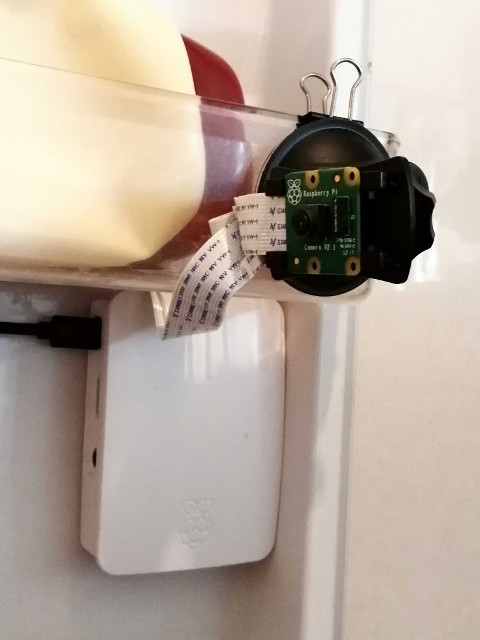
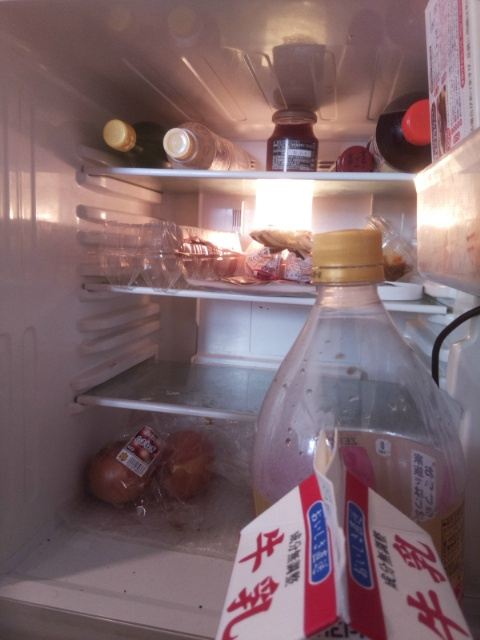

# Fridger
A fridge monitoring & reporting service.

[](assets/camera.jpg)
[](assets/sample.jpg)

<span style="color: lightgray; ">
冷蔵庫の扉にRasPi＋PiCameraを設置し、本スクリプトを実行すると、扉が開いた際、冷蔵庫の中の様子を撮影し、ファイルに保存したり、Slackに投稿してくれる。スーパーで「あれ？　まだニンジンあったっけ？」などと思ったとき、手元のスマートデバイスで、最新の冷蔵庫のスクショを確認できる。
</span>

# Require
- Raspberry Pi >= 2
- PiCamera >= 1.4
- Python >= 3.7

# Usage
1. Install
    ```
    $ cd
    $ mkdir git
    $ cd git
    $ git clone https://
    $ cd ~/git/fridger
    ```

2. Edit Settings
    ```
    $ mv settings.py.org settings.py
    $ nano settings.py
    ```

3. Execute Manually
    ```
    $ ./exec.sh
    ```

4. Register as Systemd Service
    ```
    $ ./register.sh
    ```
# Committer
s-tory